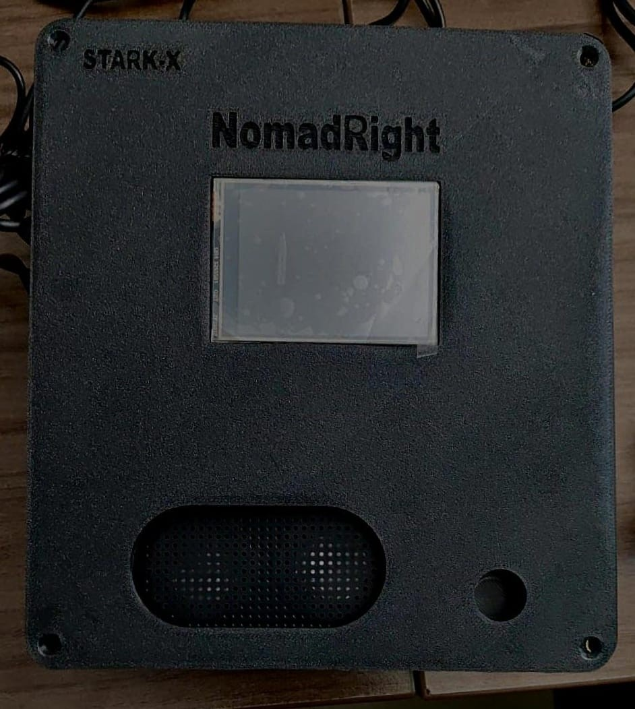
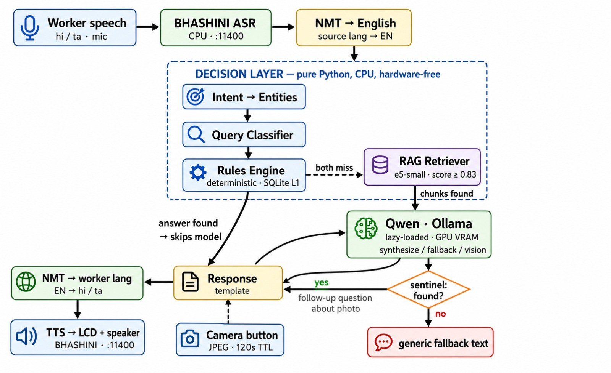

# NomadRight - Offline Voice-First Welfare Rights Navigator

> **Built on top of the [Suno Sutra SW](https://github.com/currentai-org/suno-sutra-sw) open platform by Andrew Tergis / Current AI.**

NomadRight is a 100% offline, voice-first, multilingual AI assistant for **interstate migrant workers in India**, running on edge hardware (NVIDIA Jetson Orin Nano). Workers press and hold a physical trigger button, ask a question in their own language (Hindi, Odia, Tamil, Bhojpuri, Maithili, Santali, Chhattisgarhi), and receive an authoritative spoken answer about their welfare entitlements -- all without any cloud connectivity.

The system covers **20 Government of India welfare schemes** across food security, health, housing, insurance, employment, pensions, and financial inclusion:

**Core Schemes (deterministic Rules Engine + RAG):**
- **PDS / ONORC** -- One Nation One Ration Card (ration portability across all 36 States/UTs)
- **PM-JAY (Ayushman Bharat)** -- Cashless health insurance up to Rs.5 lakh/family/year
- **e-Shram + OSH Code 2020** -- UAN registration, accident insurance, worker wage rights
- **BOCW** -- Building & Other Construction Workers welfare board benefits
- **MGNREGS** -- 100-day rural employment guarantee

**Extended Schemes (RAG pipeline):**
- **APY** -- Atal Pension Yojana (guaranteed pension for unorganised workers)
- **NSAP** -- National Social Assistance Programme (old age / widow / disability pensions)
- **PM-KISAN** -- Rs.6,000/year income support for farmers
- **PM Surya Ghar** -- Free rooftop solar electricity (300 units/month)
- **PM SVANidhi** -- Micro-credit loans for street vendors
- **PM-SYM** -- Pradhan Mantri Shram Yogi Maandhan (pension for unorganised workers)
- **PM Vishwakarma** -- Skill & credit support for traditional artisans and craftspeople
- **PMAY-G** -- Pradhan Mantri Awas Yojana Gramin (rural housing)
- **PMFBY** -- Pradhan Mantri Fasal Bima Yojana (crop insurance)
- **PMJDY** -- Jan-Dhan bank accounts with zero balance and Rs.2 lakh accident cover
- **PMJJBY** -- Jeevan Jyoti Bima Yojana (Rs.2 lakh life insurance at Rs.436/year)
- **PMMY (MUDRA)** -- Micro-enterprise loans up to Rs.20 lakh
- **PMSBY** -- Suraksha Bima Yojana (Rs.2 lakh accident insurance at Rs.20/year)
- **PMUY** -- Ujjwala Yojana (free LPG connections for BPL households)
- **Sukanya Samriddhi** -- Girl child savings scheme with 8.2% interest

A built-in **Voice Bridge** feature lets workers hand the device to a destination-state official so the last answer is read aloud in the official language (Tamil, Gujarati, Marathi, Kannada).

---

## What Makes NomadRight Different

- **Zero-hallucination-by-design, not by prompting.** Eligibility, registration, and benefit answers never touch a generative model — they come from a deterministic `RulesEngine` reading live SQLite data. Open-ended follow-ups use retrieve-then-**template** ChromaDB RAG, not retrieve-then-generate. A generative LLM only ever enters the answer path in two narrow, explicitly-gated, sentinel-checked cases (RAG+rules both miss, or a photographed document) — see [How the Decision Layer Works](#how-the-decision-layer-works). This is the opposite of "put a chatbot in front of a legal document."
- **Fully offline, on 8GB of shared Jetson memory.** ASR, NMT, TTS, embedding search, and the fallback vision/LLM model all run locally with no cloud call at any point, sized to fit a Jetson Orin Nano 8GB's unified CPU+GPU memory pool.
- **Built for a worker who can't type or read a form.** Voice-in / voice-out is the primary interface, not a fallback; a physical trigger button + touchscreen replace a keyboard, and a camera-based form-reading flow exists for the moments a scheme requires reading a printed document.
- **A voice bridge across the India language gap.** A migrant worker's own language and a destination-state official's language are rarely the same — the Voice Bridge lets a worker hand over the device and have the last answer re-spoken in the official's language, without either party needing a shared language or a translator.
- **Sourced only from official .gov.in domains**, with a full citation trail (`nomadright/citations.md`) and an automated 12-point data-quality audit (`nomadright/validate.py`) — see [Known Issues](#known-issues-current-snapshot) for where the data coverage currently falls short of that goal.

---

## Prototype

<!--
  Add your prototype / hardware / demo photo here.
  1. Save the image file into:  pocket-infer-sw/assets/
     e.g.  pocket-infer-sw/assets/nomadright_prototype.jpg
  2. Point the line below at that filename (relative to this README, i.e. "assets/<filename>").
  3. You can add more than one image (device photo, screen UI, form-scan demo) as extra rows.
-->




---

### Architecture Overview



**All AI inference is fully local** -- BHASHINI (ASR/NMT/TTS) runs at `localhost:11400`, and the vision/LLM model ([Qwen3-VL-2B-Instruct-GGUF](https://huggingface.co/Qwen/Qwen3-VL-2B-Instruct-GGUF) via Ollama) runs at `localhost:11434`. **Zero data ever leaves the device.**

---

## Repository Structure

```
pocket-infer-sw/
|-- nomadright/                        # Knowledge base and data layer (20 schemes)
|   |                                  # -- Core 5 schemes (Rules Engine + RAG) --
|   |-- pds.json                       # PDS / ONORC (ration card portability)
|   |-- pmjay.json                     # PM-JAY (Ayushman Bharat health cover)
|   |-- eshram_osh.json                # e-Shram + OSH Code 2020 (worker rights)
|   |-- bocw.json                      # BOCW (construction workers welfare)
|   |-- mgnregs.json                   # MGNREGS (rural employment guarantee)
|   |                                  # -- Extended 15 schemes (RAG pipeline) --
|   |-- apy.json                       # Atal Pension Yojana
|   |-- nsap.json                      # National Social Assistance Programme
|   |-- pm_kisan.json                  # PM-KISAN (farmer income support)
|   |-- pm_surya_ghar.json             # PM Surya Ghar (solar electricity)
|   |-- pm_svanidhi.json               # PM SVANidhi (street vendor micro-credit)
|   |-- pm_sym.json                    # PM-SYM (unorganised worker pension)
|   |-- pm_vishwakarma.json            # PM Vishwakarma (artisan skill & credit)
|   |-- pmay_g.json                    # PMAY-G (rural housing)
|   |-- pmfby.json                     # PMFBY (crop insurance)
|   |-- pmjdy.json                     # PMJDY (Jan-Dhan bank accounts)
|   |-- pmjjby.json                    # PMJJBY (life insurance)
|   |-- pmmy.json                      # PMMY / MUDRA (micro-enterprise loans)
|   |-- pmsby.json                     # PMSBY (accident insurance)
|   |-- pmuy.json                      # PMUY (Ujjwala LPG connections)
|   |-- sukanya_samriddhi.json         # Sukanya Samriddhi Account (girl child savings)
|   |-- nomadright_kb.db               # Compiled SQLite knowledge base (all 20 schemes)
|   |-- chroma_db/                     # ChromaDB vector index (all 20 schemes)
|   |-- build_sqlite_db.py             # Script to (re)build nomadright_kb.db from JSONs
|   |-- validate.py                    # JSON schema audit / validation script
|   |-- validation_report.md           # Last validation audit report
|   `-- citations.md                   # Full provenance/citations for all data sources
|
|-- python/                            # Python application module (pocketinfer)
|   |-- pocketinfer/
|   |   |-- service.py                 # pocketinfer-service CLI entry point
|   |   |-- audio.py                   # ALSA/PyAudio recording & playback helpers
|   |   |-- boards/                    # Hardware Abstraction Layer (HAL)
|   |   |-- models/                    # AI model wrappers (ASR, NMT, TTS, Ollama)
|   |   |-- ui/                        # Touchscreen LCD / UI subprocess
|   |   `-- applications/
|   |       |-- base.py                # BaseApplication class (Suno Sutra framework)
|   |       |-- registry.py            # @RegisterApplication decorator registry
|   |       |-- hear_the_world.py      # Reference application (image + voice Q&A)
|   |       `-- nomad_right/           # NomadRight application (this project)
|   |           |-- app.py             # Main entry point / run loop
|   |           |-- workflow.py        # WorkflowController - orchestrates the pipeline
|   |           |-- intent.py          # Intent recognition (keyword + knowledge matching)
|   |           |-- entities.py        # Entity extraction (scheme, state, language)
|   |           |-- classifier.py      # Query router (Rules / RAG / Translation)
|   |           |-- rules.py           # Deterministic rules engine (PDS/PMJAY/ESHRAM/BOCW)
|   |           |-- rag_pipeline.py    # ChromaDB + multilingual-e5-small RAG pipeline
|   |           |-- database.py        # SQLite knowledge base access layer
|   |           |-- knowledge_loader.py # Loads nomadright_full_db.json (FAQ/intent fallback source)
|   |           |-- bhashini_bridge.py # BHASHINI ASR/NMT/TTS adapter + voice-styling DSP
|   |           |-- qwen_client.py     # Ollama client for the LLM/vision fallback path (see Known Issues)
|   |           |-- response.py        # Structured response builder
|   |           |-- config.py          # NomadRightConfig dataclass
|   |           |-- constants.py       # All application-wide constants
|   |           |-- benchmark.py       # Performance benchmarking script
|   |           |-- pipeline_test.py   # Full pipeline regression tests
|   |           |-- audit_fix_regression_test.py  # Audit fix regression tests
|   |           |-- ui_navigation_test.py  # Touchscreen UI navigation tests
|   |           `-- lcd_log_test.py    # LCD/log output tests
|   |-- requirements.txt               # Python dependencies
|   `-- setup.py                       # Package setup
|
|-- rootfs/                            # Ansible provisioning for Jetson device
|   |-- roles/                         # Ansible roles (BHASHINI models, CUDA, fonts...)
|   |-- install_all_usb.yml            # Full device provisioning playbook
|   |-- update_only_usb.yml            # App-only update playbook
|   |-- inventory.ini                  # Ansible inventory (device USB IP)
|   `-- Jetson_Flash.md                # Jetson OS flashing guide (JetPack 6.2)
|
|-- ioexpander/                        # IO Expander microcontroller firmware
|-- assets/                            # Architecture diagrams and images
|-- benchmark_results.csv              # On-device performance benchmarks
|-- nomadright_full_db.json            # Full denormalized scheme database (JSON)
|-- MISSING_LFS_ASSETS.md             # Notes on Git LFS binary assets
`-- LICENSE                            # MIT License
```

---

## Hardware Requirements

NomadRight runs on the **Suno Sutra** hardware platform -- an open edge-AI device built around the NVIDIA Jetson:

| Component | Specification |
|-----------|---------------|
| **SoC Module** | NVIDIA Jetson Orin Nano 8GB (primary) |
| **Carrier Board** | Seeedstudio ReComputer Mini *or* NVIDIA Orin Nano Dev Kit |
| **OS / Platform** | JetPack 6.2 (Ubuntu 22.04, aarch64) |
| **Camera** | Arducam CSI (on-device) / USB webcam (dev board) |
| **Display** | 320x240 ILI9341 TFT touchscreen |
| **Audio I/O** | Built-in microphone + speaker (ALSA) |
| **Connectivity** | USB-C (USB RNDIS Ethernet + USB CDC serial) |

> For development without the full kiosk hardware, use `--dummy-board` to run on any Linux machine with a pre-recorded audio file and sample image.

---

## Software Prerequisites

### System Packages

On the Suno Sutra device (or any Ubuntu 22.04 arm64 / x86 dev machine):

```bash
sudo apt update
sudo apt install -y \
    libasound-dev portaudio19-dev libportaudio2 \
    ffmpeg flac python3-pip python3-venv git
```

> **On the actual Suno Sutra device**, all system dependencies (BHASHINI model packages, Jetson ML libraries, Flite Indic TTS voices, ChromaDB, etc.) are provisioned automatically by the Ansible playbooks in `rootfs/`. The packages above are only needed for local development.

### AI Model Services

| Service | Purpose | Default Endpoint |
|---------|---------|-----------------|
| **BHASHINI** (ASR + NMT + TTS) | Speech recognition, translation, synthesis | `localhost:11400` |
| **Ollama** (Qwen3-VL-2B-Instruct-GGUF) | LLM fallback + camera form reading | `localhost:11434` |

**Install Ollama and pull the model:**

```bash
# Install Ollama (Linux)
curl -fsSL https://ollama.com/install.sh | sh

# Pull the Qwen3-VL-2B-Instruct-GGUF model from HuggingFace via Ollama
ollama pull hf.co/Qwen/Qwen3-VL-2B-Instruct-GGUF
```

> The Qwen3-VL-2B model is used **only as a last-resort fallback** when both the Rules Engine and RAG pipeline find no matching answer, and for the camera-based government form-reading feature. It is never the primary answer path.

---

## Setup Instructions

Follow these steps in order on a fresh device or development machine.

### Step 1 -- Clone the Repository

```bash
git clone https://github.com/<your-org>/pocket-infer-sw.git
cd pocket-infer-sw
```

On the Suno Sutra device, the repo is typically cloned to `/home/ubuntu/pocket-infer-sw`.

### Step 2 -- Create and Activate a Python Virtual Environment

```bash
# Create the virtual environment
python3 -m venv python/venv

# Activate (Linux / macOS)
source python/venv/bin/activate

# Activate (Windows -- development only)
# python\venv\Scripts\activate
```

### Step 3 -- Install Python Dependencies

```bash
# Install the pocketinfer package in editable mode (recommended for development)
pip install -e python/

# Or install from requirements.txt directly
pip install -r python/requirements.txt
```

Key dependencies: `ollama`, `chromadb`, `sentence-transformers`, `pyaudio`, `vosk`, `piper-tts`, `opencv-python`, `psutil`, and Adafruit CircuitPython display libraries.

### Step 4 -- Build the SQLite Knowledge Base

A pre-built `nomadright_kb.db` is already included in the repository. Rebuild only if you update the scheme JSON files:

```bash
cd nomadright/
python build_sqlite_db.py
```

This ingests `pds.json`, `pmjay.json`, `eshram_osh.json`, `bocw.json`, and `mgnregs.json` into a normalized 12-table SQLite database with foreign keys and performance indexes.

### Step 5 -- Build the ChromaDB RAG Vector Index

A pre-built index is in `nomadright/chroma_db/`. Rebuild only when scheme JSON data changes:

```bash
# Run from the repo root with the venv active
python -m pocketinfer.applications.nomad_right.rag_pipeline --build-cache
```

This embeds all scheme passages using `intfloat/multilingual-e5-small` (~118 MB, supports Hindi/Odia/Tamil queries) and writes the index to `nomadright/chroma_db/`.

### Step 6 -- Validate the Knowledge Base (Optional but Recommended)

```bash
cd nomadright/
python validate.py
```

Runs a 12-point audit: schema compliance, type checks, empty array detection, duplicate FAQs/benefits, URL validity, official domain verification, state name validation against all 36 Indian States/UTs, and cross-file scheme ID uniqueness.

---

## Running NomadRight

### On a Device with a UI (Handheld Kiosk)

The Suno Sutra Demo device boots directly into the application. After ~30-60 seconds the status bar shows **ready**.

**Basic operation:**
1. Press and **hold** the trigger button -- the device starts listening
2. Ask your question in your language (Hindi, Tamil, Odia, etc.)
3. Release the button
4. The answer appears on the LCD and is spoken aloud via the speaker

**Voice Bridge (for officials):** After receiving an answer, say *"translate this for the officer"* -- the last answer will be spoken in the destination official's language (set via touchscreen Settings -> Bridge Language).

**Camera / Form Reading:** Press the **Camera** button on the touchscreen, photograph a government document, then hold the trigger and ask a question about it. The Qwen vision model reads the document and answers.

### On a Development Board (Headless / SSH)

```bash
# Connect via USB and SSH in
ssh ubuntu@192.168.55.1
# Default password: ubuntu

# Activate the virtual environment
source ~/pocket-infer-sw/python/venv/bin/activate

# Run NomadRight (default language: Hindi)
pocketinfer-service --app NomadRight

# Run with Tamil as input language
pocketinfer-service --app NomadRight --setting input_language=ta

# Run headless (real hardware, no touchscreen -- status to console)
pocketinfer-service --app NomadRight --headless

# List all registered applications
pocketinfer-service --list-apps
```

### Running Locally for Development (Dummy Board -- No Hardware Required)

```bash
# Activate the venv
source python/venv/bin/activate

# Run with a pre-recorded test audio file
pocketinfer-service \
    --app NomadRight \
    --dummy-board \
    --audio-file test.wav \
    --log-level DEBUG
```

### Full CLI Reference

| Flag | Default | Description |
|------|---------|-------------|
| `--app <name>` | `HearTheWorld` | Name of the application to run |
| `--dummy-board` | `False` | Use file-based audio/image inputs instead of hardware |
| `--headless` | `False` | Skip touchscreen UI subprocess; output status to console |
| `--audio-file <path>` | -- | Path to 16kHz 16-bit WAV file (dummy board mode) |
| `--image-file <path>` | -- | Path to image file (dummy board mode) |
| `--setting key=value` | -- | Override an application setting (repeatable) |
| `--settings-file <path>` | -- | Path to JSON file with application settings |
| `--log-level <level>` | `INFO` | Verbosity: DEBUG / INFO / WARNING / ERROR / CRITICAL |
| `--list-apps` | -- | Print all registered applications and exit |
| `--update-app` | -- | Download/install model dependencies for the app, then exit |

---

## Configuring NomadRight

Pass settings inline or via a JSON file:

```bash
# Inline settings
pocketinfer-service --app NomadRight \
    --setting input_language=or \
    --setting bridge_language=mr

# JSON settings file
pocketinfer-service --app NomadRight --settings-file my_settings.json
```

**Example `my_settings.json`:**

```json
{
  "input_language": "hi",
  "bridge_language": "ta",
  "log_directory": "/tmp/nomad_right_logs",
  "offline_mode": true,
  "rag_top_k": 3
}
```

### Supported Languages

**Worker Input Languages (ASR -- what the worker speaks):**

> **Important:** BHASHINI ASR has been confirmed by the BHASHINI team to support **only Hindi and Tamil** on this deployment. The other language codes listed in `constants.py` are framework placeholders for future model availability.

| Code | Language | Region | ASR Status |
|------|----------|--------|------------|
| `hi` | Hindi | North India | **Supported** *(default)* |
| `ta` | Tamil | Tamil Nadu | **Supported** |
| `or` | Odia | Odisha | Pending BHASHINI model |
| `bho` | Bhojpuri | Bihar / Eastern UP | Pending BHASHINI model |
| `mai` | Maithili | Bihar / Jharkhand | Pending BHASHINI model |
| `sat` | Santali | Jharkhand / Odisha / WB | Pending BHASHINI model |
| `hne` | Chhattisgarhi | Chhattisgarh | Pending BHASHINI model |

**Voice Bridge Languages (for destination-state officials):**

| Code | Language | State |
|------|----------|-------|
| `ta` | Tamil | Tamil Nadu *(default)* |
| `gu` | Gujarati | Gujarat |
| `mr` | Marathi | Maharashtra |
| `kn` | Kannada | Karnataka |

---

## How the Decision Layer Works

NomadRight's core Decision Layer processes every voice query through a strict pipeline -- **zero hallucination** is an explicit design requirement for legal welfare entitlements:

### Voice Query Pipeline (Primary)

1. **Speech Recognition** -- BHASHINI ASR transcribes the worker's spoken query. **Confirmed supported languages: Hindi (`hi`) and Tamil (`ta`) only** (confirmed by BHASHINI team; other language codes are placeholders pending future model availability).
2. **NMT Translation (-> English)** -- BHASHINI NMT translates the native text to English for the Decision Layer.
3. **Intent Recognition** -- A three-phase keyword + knowledge-base phrase-matching engine maps the query to one of 20 intent types (e.g. `PDS_PORTABILITY`, `BOCW_REGISTRATION`, `ESHRAM_WAGE_RIGHTS`, `WELFARE_OVERVIEW`).
4. **Entity Extraction** -- Extracts named entities: scheme code, Indian state name, language code.
5. **Query Classification** -- Routes to one of three subsystems:
   - **Rules Engine** -- Deterministic, data-driven answers for 14 known intent types across PDS, PM-JAY, e-Shram, and BOCW. Facts are read live from the SQLite knowledge base -- no hardcoded strings.
   - **RAG Pipeline** -- ChromaDB + `multilingual-e5-small` semantic search (min score threshold 0.83). Covers all 20 schemes; the 15 extended schemes (APY, NSAP, PM-KISAN, PM SVANidhi, PM-SYM, PM Vishwakarma, PMAY-G, PMFBY, PMJDY, PMJJBY, PMMY, PMSBY, PMUY, PM Surya Ghar, Sukanya Samriddhi) are answered exclusively via RAG.
   - **LLM Fallback** -- Qwen2.5-VL:3B via Ollama, only when Rules + RAG both find nothing. Grounded with retrieved context and a strict `NOT_IN_CONTEXT` sentinel to prevent hallucination.
6. **Response + TTS** -- The English answer is NMT-translated back to Hindi or Tamil, then synthesised via BHASHINI TTS and played on the speaker.

### Camera Form-Reading Pipeline (Vision)

1. **Camera Capture** -- Worker presses the **Camera** button on the touchscreen; the board captures a JPEG frame (Arducam CSI on-device, USB webcam on dev board).
2. **Image Held in Memory** -- The JPEG is stored with a 120-second TTL timestamp. If the worker walks away without asking, the stale photo is silently discarded.
3. **Follow-Up Voice Query** -- Worker holds the trigger and asks a question about the photographed document (Hindi or Tamil via BHASHINI ASR).
4. **Vision LLM ([Qwen3-VL-2B-Instruct-GGUF](https://huggingface.co/Qwen/Qwen3-VL-2B-Instruct-GGUF))** -- The English query + the JPEG (base64-encoded) + relevant RAG context chunks are sent to Qwen3-VL-2B via Ollama. The model is instructed to answer **only from the document/context** or return `NOT_IN_CONTEXT` verbatim.
5. **Grounded Answer or Fallback** -- If the model answers, the text is NMT-translated to Hindi/Tamil and spoken aloud. If `NOT_IN_CONTEXT` is returned, the constant fallback message is used instead.
6. **One Photo, One Question** -- After each answered query the image is cleared. A new Camera press is required for another form-reading query.

---

## Installing as a System Service (On-Device)

NomadRight can run as a systemd service that starts automatically on boot:

```bash
# From the python directory on the device
cd ~/pocket-infer-sw/python

# Copy the service unit file
sudo cp pocketinfer.service /etc/systemd/system/

# Reload systemd and enable the service
sudo systemctl daemon-reload
sudo systemctl enable pocketinfer
sudo systemctl start pocketinfer

# Stream live logs
journalctl -f -u pocketinfer
```

To set NomadRight as the default app, edit `/etc/systemd/system/pocketinfer.service` and add `--app NomadRight` to the `ExecStart` line, then `sudo systemctl restart pocketinfer`.

---

## Provisioning a New Jetson Device (Ansible)

The `rootfs/` directory contains Ansible playbooks for full automated provisioning:

```bash
cd rootfs/

# Full install -- CUDA, BHASHINI models, app dependencies, fonts, etc.
ansible-playbook -i inventory.ini install_all_usb.yml

# App-layer update only (faster, for code changes)
ansible-playbook -i inventory.ini update_only_usb.yml
```

See `rootfs/Jetson_Flash.md` for step-by-step Jetson OS flashing instructions (JetPack 6.2).

> **Warning -- Git LFS Assets:** Several provisioning binaries (BHASHINI model packages, Flite voice ZIPs, CUDA keyring .deb, compiled wheel files) were stored as Git LFS objects and are not present in this snapshot. See `MISSING_LFS_ASSETS.md` for the full list and restoration instructions.

---

## Development Guide

### Creating a New Application

NomadRight is one of several applications in the Suno Sutra framework. New applications are simple to add:

```bash
# SSH into the device
ssh ubuntu@192.168.55.1

# Copy the reference app as a template
cd ~/pocket-infer-sw/python
cp pocketinfer/applications/hear_the_world_en.py \
   pocketinfer/applications/my_new_app.py

# Edit your new app
vim pocketinfer/applications/my_new_app.py
```

In the file:
1. Rename the class (e.g. `MyNewApp`)
2. Update the `@RegisterApplication({...})` manifest (name, description, models, default_settings)
3. Implement your logic in the `run(self)` method

Then launch:

```bash
# On devices with touchscreen UI
sudo systemctl restart pocketinfer && journalctl -f -u pocketinfer

# On development boards -- run directly
pocketinfer-service --app MyNewApp

# Local development -- dummy board mode
pocketinfer-service --app MyNewApp --dummy-board --audio-file test.wav
```

### Running Tests

```bash
# Activate the virtualenv
source python/venv/bin/activate

# Full NomadRight pipeline regression tests
python -m pytest python/pocketinfer/applications/nomad_right/pipeline_test.py -v

# Audit fix regression tests (rule engine correctness)
python -m pytest python/pocketinfer/applications/nomad_right/audit_fix_regression_test.py -v

# On-device latency benchmark
python python/pocketinfer/applications/nomad_right/benchmark.py
```

### Updating Scheme Data

1. Edit the relevant JSON in `nomadright/` (e.g. `pds.json`)
2. Validate: `python nomadright/validate.py`
3. Rebuild SQLite DB: `python nomadright/build_sqlite_db.py`
4. Rebuild RAG index: `python -m pocketinfer.applications.nomad_right.rag_pipeline --build-cache`

All scheme data must be sourced from **official Government of India portals only**. See `nomadright/citations.md` for the full provenance record.

---

## Supported Hardware Matrix

| Platform | Module | Carrier Board | Status |
|----------|--------|---------------|--------|
| NVIDIA Jetson / JetPack 6.2 | Orin Nano 8GB | Seeedstudio ReComputer Mini | Fully Supported |
| NVIDIA Jetson / JetPack 6.2 | Orin Nano 8GB | NVIDIA Orin Nano Dev Kit | Fully Supported |
| NVIDIA Jetson / JetPack 6.2 | Orin NX 8GB | Waveshare Dev Kit | In Progress |
| NVIDIA Jetson / JetPack 6.2 | Orin NX 16GB | -- | In Progress |
| NVIDIA Jetson / JetPack 6.2 | Jetson Thor | -- | Not Yet Supported |
| Raspberry Pi 5 / CM5 | -- | -- | Not Yet Supported |
| Generic Linux (x86 / ARM) | -- | -- | Not Yet Supported |

---


## License

This project is licensed under the **MIT License** -- see the [LICENSE](./LICENSE) file for full terms.

```
MIT License

Copyright (c) 2026 Current AI (Suno Sutra SW platform)
Copyright (c) 2026 STARK-X (NomadRight application)

Permission is hereby granted, free of charge, to any person obtaining a copy
of this software and associated documentation files (the "Software"), to deal
in the Software without restriction, including without limitation the rights
to use, copy, modify, merge, publish, distribute, sublicense, and/or sell
copies of the Software, and to permit persons to whom the Software is
furnished to do so, subject to the following conditions:

The above copyright notice and this permission notice shall be included in all
copies or substantial portions of the Software.

THE SOFTWARE IS PROVIDED "AS IS", WITHOUT WARRANTY OF ANY KIND, EXPRESS OR
IMPLIED, INCLUDING BUT NOT LIMITED TO THE WARRANTIES OF MERCHANTABILITY,
FITNESS FOR A PARTICULAR PURPOSE AND NONINFRINGEMENT. IN NO EVENT SHALL THE
AUTHORS OR COPYRIGHT HOLDERS BE LIABLE FOR ANY CLAIM, DAMAGES OR OTHER
LIABILITY, WHETHER IN AN ACTION OF CONTRACT, TORT OR OTHERWISE, ARISING FROM,
OUT OF OR IN CONNECTION WITH THE SOFTWARE OR THE USE OR OTHER DEALINGS IN THE
SOFTWARE.
```

---

## Acknowledgements

- **[Suno Sutra SW](https://github.com/currentai-org/suno-sutra-sw)** by Andrew Tergis / Current AI -- the open-source edge-AI hardware and software platform that NomadRight is built on top of.
- **[BHASHINI](https://bhashini.gov.in/)** -- India's national AI-powered language platform, providing offline ASR, NMT, and TTS for Indic languages.
- **[Qwen3-VL-2B-Instruct-GGUF](https://huggingface.co/Qwen/Qwen3-VL-2B-Instruct-GGUF)** by Alibaba / Qwen Team -- the vision-language model (GGUF format, run via Ollama) used for government form reading and last-resort text fallback.
- **[ChromaDB](https://www.trychroma.com/)** + **[intfloat/multilingual-e5-small](https://huggingface.co/intfloat/multilingual-e5-small)** -- the offline semantic search stack powering the RAG pipeline.
- Government of India open data portals (`myscheme.gov.in`, `nha.gov.in`, `pmjay.gov.in`, `eshram.gov.in`, `nrega.nic.in`, `dfpd.gov.in`, `pib.gov.in`) -- all scheme data is sourced exclusively from official .gov.in domains.
